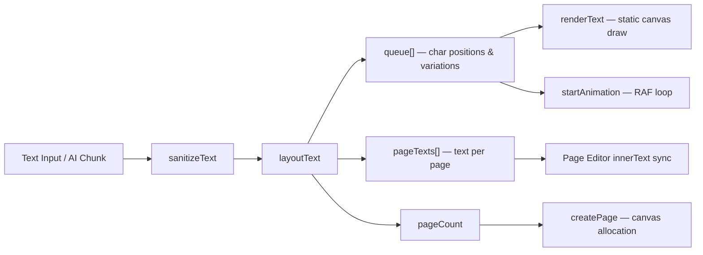

# 🏛️ System Architecture

This document outlines the **high-level system architecture**, **component layers**, and **data flow** of the InkForge Handwritten Notes Generator.

---

## Architecture Overview

InkForge is architected as a highly modular, decoupled, single-file client-side application. It operates entirely within the user's browser, eliminating backend latency and optimizing rendering speeds.

---

## Component Map

The application's structural components are divided into four primary layers:

```mermaid
graph TD
    subgraph UI_Layer [User Interface Layer]
        A[Control Console / Sidebar]
        B[Floating Top Toolbar]
        C[Canvas Viewport + Page Editors]
        D[Floating Pagination Controls]
    end

    subgraph State_Layer [State Management Layer]
        E[Global State Object S]
        F[Debounced Autosave Module]
        G[LocalStorage Interface]
        R[IndexedDB Glyph Store]
    end

    subgraph Engine_Layer [Core Execution Engines]
        H[Paper Renderer]
        I[Glyph Variation Engine]
        J[layoutText — Unified Layout Engine]
        K[Writing Queue & Animation Engine]
        L[Page Editor Sync Layer]
        DE[Diagram Engine — layoutCycle, layoutFlowchart, layoutHierarchy]
    end

    subgraph External_Layer [Integration & Export Services]
        M[OpenRouter / Anthropic Claude API — SSE Streaming]
        N[Blob URL Export — PNG / JPG / SVG]
        O[jsPDF Multi-Page Document Compiler]
        P[Clipboard API — Copy as PNG]
        Q[OS Print Spooler]
    end

    A -->|User Input Events| E
    B -->|Action Controls| E
    E -->|State Synchronization| F
    F -->|Serialized Save| G
    G -->|State Hydration| E
    R -->|Glyph Data Hydration| E

    E -->|Render Triggers| H
    E -->|Transform Configs| I
    E -->|Spacing / Size Controls| J
    E -->|Speed & Mode Controls| K

    H -->|Paint Canvas Backgrounds| C
    I -->|Matrix Transforms| C
    J -->|Char Queue + Page Texts| K
    J -->|Char Queue| L
    K -->|RAF Loop & Vector Pen Positioning| C
    L -->|Editor innerText Sync| C

    A -->|AI Action Requests + SSE stream| M
    M -->|Incremental Text Chunks| E
    C -->|canvas.toBlob()| N
    C -->|JPEG Binary Stream| O
    C -->|canvas.toBlob() PNG| P
    C -->|Print Style Overrides| Q
```

---

## Layer Descriptions

### 1. User Interface Layer
The visible DOM elements the user interacts with directly. These include the sidebar control console (300px width), the floating top toolbar (56px fixed header), the main canvas grid viewport with inline page editors (`.page-editor` contenteditable overlays), and the bottom pill-style pagination controls.

### 2. State Management Layer
A centralized global configuration object `S` acts as the single source of truth. Changes to any UI control update `S`, which triggers re-rendering. A debounced autosave module serializes the state to `localStorage` after a 1000ms idle delay. Custom handwriting glyph data is stored in **IndexedDB** (`InkForgeDB` → `draftedGlyphs` store) to bypass the 5MB `localStorage` quota limit.

### 3. Core Execution Engines
The rendering pipeline that transforms state data into visual canvas output. As of v1.20.1, the codebase is one **ES-module graph**: `index.html` loads a single `<script type="module" src="index.js">` and every cross-module dependency is an explicit `import` — no `window.*` glue, no inline handlers.

| Module | Lines | Purpose |
|--------|------:|---------|
| `index.js` | ~900 | Boot, initApp, stroke prediction, page-editor focus, collaboration glue, AI registry, theme packs, error hook |
| `handfonted-studio.js` | 1,266 | HandFonted Studio: sketch/template glyph capture, aligner, TTF build |
| `ui-bindings.js` | 808 | Per-panel binder functions wiring every control (no inline handlers) |
| `render-pipeline.js` | 668 | renderText / renderSpecificPage / animation / page DOM + drafted-glyph image cache |
| `layout-engine.js` | 634 | layoutText + zone-chaining templated engine, sticky/callout painters, margin labels |
| `template-manager.js` | 560 | 8 built-in layouts (template gallery) + custom templates |
| `ai-assistant.js` | 552 | Provider router (OpenRouter / Anthropic / Gemini / Ollama), aiAction, GrammarCorrector |
| `paper-renderer.js` | 529 | 10 paper styles (LRU-cached backgrounds), smudge effects |
| `markdown-parser.js` | 442 | Markdown tokenization for AI output |
| `collaborative-engine.js` | 388 | WebSocket real-time collaboration (OT client) |
| `layer-compositor.js` | 375 | Multi-layer canvas compositing |
| `diagram-engine.js` | 370 | 6 diagram types, Mermaid rendering |
| `persistence.js` | 306 | autosave / restoreState, autosave whitelist + serialization |
| `export-manager.js` | 294 | PNG / JPG / transparent / PDF / SVG / clipboard pipelines |
| `font-compilation.js` | 287 | Contour tracing, RDP, OpenType compilation |
| `cursive-connector.js` | 283 | Cursive exit/entry points, Bezier strokes |
| `flashcards.js` | 279 | Flashcards, study mode, SM-2 lite spaced repetition |
| `ai-postprocess.js` | 230 | sanitizeAiResponse, resequenceQA, smartArrangeLocal |
| `stroke-prediction-engine.js` | 209 | Stroke completion prediction |
| `state.js` | 205 | Shared state: S, pages, PAGE_W/PAGE_H, cursiveConnector, draftedGlyphs, fontSwitcher |
| `export-renderers.js` | 191 | Queue item rendering on canvas |
| `audio-recorder.js` | 182 | Audio recording, waveform |
| `shape-drawing.js` | 178 | drawArrowhead / drawShapeOrEdge (rough.js) |
| `notebooks.js` | 167 | IndexedDB CRUD, notebook sidebar UI |
| `script-detector.js` | 154 | Unicode script detection + FontSwitcher |
| `text-layout.js` | 143 | sanitizeText, parseBlocks, getGraphemes, parseRichSyntax |
| `i18n.js` | 143 | EN/हिंदी string tables, language toggle |
| `margin-labels.js` | 118 | Margin Q/Ans clustering + drawing |
| `voice-notes.js` | 87 | Web Speech voice-to-notes |
| `sw.js` | 69 | Service worker (build-generated precache) |
| `settings-sync.js` | 53 | Sidebar control-sync helpers shared with persistence.js |
| `inkfont-format.js` | 19 | .inkfont share format wrap/parse |

The **unified `layoutText()` engine** (layout-engine.js) performs all word-wrap, page-break, and character queue computation in a single pass, ensuring layout parity between static rendering and animation. Shared state (S, pages, PAGE_W/PAGE_H, cursiveConnector, draftedGlyphs, fontSwitcher) lives in `state.js` and is imported as live bindings; index.js keeps only boot/init and the pieces nothing else owns.

### 4. Integration & Export Services
External integrations for AI text generation (OpenRouter, Anthropic, Google Gemini, and local Ollama — all with SSE streaming), native canvas image exports (Blob URL-based PNG/JPG/SVG), multi-page PDF compilation (jsPDF), clipboard copy (Clipboard API), and native OS print dialog access.

---

## Rendering Pipeline Data Flow



---

## Key Architectural Strengths

1. **Unified Layout Engine**: A single `layoutText()` function handles all word-wrap, page-break, and character coordinate calculations — ensuring layout parity between static renders and animations.
2. **Perfect Decoupling**: The central config state `S` is completely decoupled from the rendering loop. Updates to inputs, themes, or text simply update `S` and trigger a canvas repaint.
3. **SSE Streaming AI**: AI responses stream word-by-word into the canvas in real time, preventing UI freezing and providing instant visual feedback.
4. **Blob-based Export**: All exports use native `canvas.toBlob()` rather than DataURL strings, resolving browser download limits for large documents and improving memory efficiency.
5. **Inline Page Editing**: Transparent `contenteditable` overlays over each canvas allow direct text editing on the page, with automatic sync back to the global text state.
6. **Pristine Client-Side Vectorization**: Performs real-time Moore-Neighbor contour tracing, RDP curve simplification, and TTF compilation purely inside the browser.
7. **Standalone Portability**: All styling, layout logic, rendering scripts, and third-party dependencies run inside a single, portable HTML file that works offline in any browser.
8. **Modular Diagram Engine**: Extracted diagram layout algorithms into `diagram-engine.js`, supporting 6 diagram types (Cycle, Flowchart, Hierarchy, Pipeline, Pyramid, Mermaid) with rough.js hand-drawn shapes, edge labels, and node labels. Exposed via `window.DiagramEngine` for browser globals and `module.exports` for Node.js testing.
