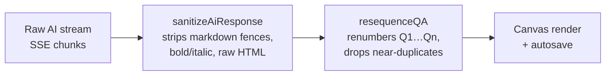

# AI Setup & Workflows

InkForge talks to AI providers **directly from your browser** — there is no middleman server. Your API key is entered at runtime and stored only in your browser's `localStorage`.

---

## Choosing a Provider

| Provider | API key | Models | Good for |
| :--- | :--- | :--- | :--- |
| **OpenRouter** *(primary)* | Required | 100+ models (Google, Anthropic, OpenAI, Meta, DeepSeek, Mistral, Qwen, xAI, …), free models auto-tagged & sorted first | Flexibility; grab a free model |
| **Anthropic** (direct) | Required | Claude Sonnet 4, Claude 3.5 Sonnet / Haiku, Claude 3 Opus / Haiku | Direct Claude access |
| **Ollama** (local) | **None** | Whatever you've pulled locally | Fully private, offline AI |

### Setup steps

1. **OpenRouter** — create a key at [openrouter.ai](https://openrouter.ai/keys), pick it as provider, paste the key. The model list auto-fetches from OpenRouter on load and refreshes when you switch provider.
2. **Anthropic** — create a key in the Anthropic Console, select provider, paste key (uses the `anthropic-dangerous-direct-browser-access` header for direct browser calls).
3. **Ollama** — install [Ollama](https://ollama.com) locally, pull a model, select the *Ollama* provider and pick your model. No key needed.

> ⚠️ Never commit or share your API key. InkForge never transmits it anywhere except to the provider you selected.

---

## The Five Workflows

| Action | What it does | Needs key? |
| :--- | :--- | :--- |
| 🪄 **Smart Arrange** | Deterministic offline tidy-up: normalizes headings (`#Title → # Title`), tags (`[sticky : yellow] → [sticky:yellow]`), highlights (`== key == → ==key==`), bullets (`*`, `•`, `–` → `- `), Q&A numbering (`q1:` → `Q1:`), punctuation spacing, blank-line structure | **No** — 100% offline since v1.6.7 |
| 📋 **Summarize** | Restructures text into bullet notes with highlights, a takeaway sticky and 2–3 flashcards | Yes (or Ollama) |
| ✏️ **Fix Grammar** | Corrects spelling & phrasing, keeps meaning | Yes (or Ollama) |
| 🎓 **Lecture → Notes** | Turns raw transcripts into structured study notes with callouts, exam-tip stickies and flashcards | Yes (or Ollama) |
| 📝 **Generate Assignment** | Writes a full academic assignment on a topic (topic field; falls back to current text) | Yes (or Ollama) |

AI output is instructed (via the master system prompt) to use InkForge's native syntax — `#`, `##`, `-`, `==…==`, `[sticky:…]`, `[callout:…]`, `Q:`/`A:` — so results render natively on the paper.

---

## How It Works Under the Hood



- **Streaming** — responses arrive via Server-Sent Events (`stream: true`) and land word-by-word on the canvas, throttled to a re-render every 200 ms so the UI never freezes.
- **`sanitizeAiResponse()`** — strips ``` code fences (keeping the code body), inline backticks, `**bold**`/`*italic*`, and raw HTML tags while preserving InkForge syntax tags.
- **`resequenceQA()`** — renumbers flashcards sequentially (ignoring whatever numbers the model invented) and drops near-duplicate questions using trigram Jaccard similarity (≥ 72% similarity ⇒ dropped, together with its answer).

### Status & error messages

Status appears in the AI status line (`#ai-status`):

| Message | Meaning |
| :--- | :--- |
| `✦ Generating…` | Request in flight |
| `✓ Done — <model>` | Stream finished |
| `⚠ Enter your OpenRouter/Anthropic API key first.` | No key set for that provider |
| `✕ API Error: <message>` | The provider rejected the request (bad key, rate limit, …) |
| `✕ Network error: <message>` | Provider host unreachable (offline / blocked network) |
| `⚠ Add some text first.` / `⚠ Paste lecture text first.` / `⚠ Enter a topic first.` | Empty input for that action |

---

## Privacy Recap

- Keys and notes never leave your device except in the direct HTTPS call to your chosen provider.
- Ollama runs on your own machine — the whole loop can stay airgapped.
- Smart Arrange needs no provider at all.

See also: [Study Syntax Cheatsheet](Study-Syntax-Cheatsheet) for the markup the AI emits.
