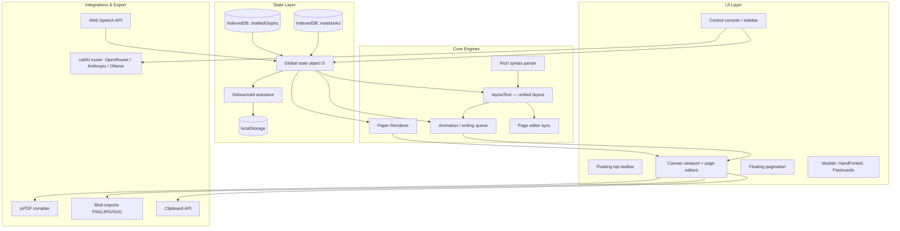
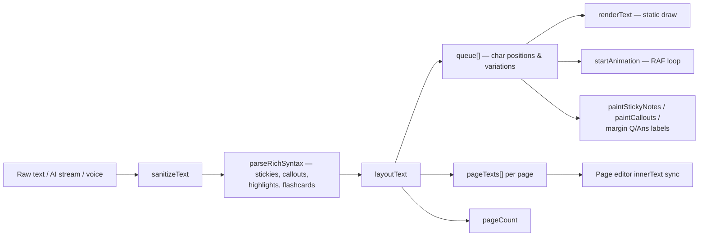

# Architecture & Internals

InkForge is a modular, decoupled, **client-side** application. No backend, no framework, no build step — `index.js` (~7,300 lines of vanilla ES2022) is the whole engine. This page is the map; the in-repo [`docs/`](https://github.com/VIPHACKER100/InkForge/tree/main/docs) suite has the deep dives (including the full [API Reference](https://github.com/VIPHACKER100/InkForge/blob/main/docs/api-reference.md)).

---

## The Three Apps in the Repo

1. **The Studio Editor** — `index.html` / `index.css` / `index.js`: the handwriting workspace with canvas, study tools and AI integrations.
2. **The About portal** — `about.html` / `about.css`: standalone showcase with a live, interactive Realism Engine simulator.
3. **PWA shell** — `sw.js` + `manifest.json`: pre-caches both pages for full offline availability; shares dark-mode state via `localStorage` (`inkforge-dark`).

## Component Map

## The Rendering Pipeline

**Key ideas:**

- **Unified `layoutText()`** — one pass computes word-wrap, page breaks and every character's coordinates, then dispatches to specialist engines (`layoutTextTwoColumn`, `layoutTextCornell`, `layoutTextCleanStandard`). Static render and animation consume the *identical* queue, so WYSIWYG is guaranteed.
- **Per-character variation** — each glyph gets seeded-random tilt/scale/shear/drift/pressure from a deterministic `mulberry32` PRNG. See [The Realism Engine](The-Realism-Engine).
- **Persistent canvases** — pages are drawn once and stay; re-renders happen only on setting/text changes (debounced 280 ms).
- **Inline page editors** — transparent `contenteditable` overlays over each canvas sync back into the global text state on input.

## State & Storage

The global object **`S`** is the single source of truth (text, font, sizes, ink, paper style, layout, animation speed, page dates/numbers, header & margin-label toggles, …). Full field table in [`docs/state-management.md`](https://github.com/VIPHACKER100/InkForge/blob/main/docs/state-management.md).

| Store | Key / DB | Contents |
| :--- | :--- | :--- |
| localStorage | `inkforge-state` | Serialized settings (1000 ms debounced autosave) |
| localStorage | `inkforge-dark` | Dark-mode flag (shared with the About page) |
| localStorage | `inkforge-fonts` | Uploaded custom font family names |
| localStorage | `inkforge-pdf-size` | PDF output preset |
| IndexedDB | `InkForgeDB → draftedGlyphs` | HandFonted glyph images (per character) |
| IndexedDB | `InkForgeDB → notebooks` | Notebook records (content, folder, tags, per-note settings) |

On boot, `initApp()` hydrates glyphs + settings, migrates any legacy localStorage glyphs into IndexedDB, prunes blank glyphs, creates a welcome note on first run, and renders the active notebook.

## Security & Event Wiring

- All UI handlers are attached by `bindUIActions()` via `addEventListener` — **no inline `onclick`** attributes.
- User-provided content (notebook titles, folder names) is escaped with `escapeHtml()` before any innerHTML injection.
- `.github/workflows/codeql.yml` runs CodeQL static analysis on every push/PR and weekly.
