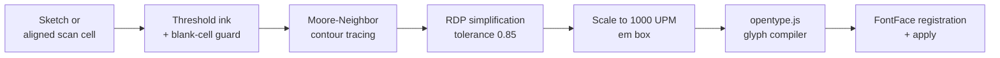

# HandFonted Studio (Custom Fonts)

HandFonted Studio is InkForge's built-in custom font suite. It turns your own handwriting into a real **TrueType font** — entirely inside the browser: raster-to-vector tracing, curve smoothing and OpenType compilation are all client-side. Nothing is uploaded.

You can use it two ways: sketch each character on the live sketchpad, or fill a printable template sheet with pen and paper and scan/photograph it.

---

## Character Coverage

Two template sheets, **84 characters** total:

- **Letters** — `A–Z`, `a–z` (52)
- **Numbers & symbols** — `0–9`, `. , ? ! @ # $ % ^ & * ( ) - _ + = / : ; ' "` (32)

---

## Workflow A: Printable Template

1. Pick the sheet (*Letters* or *Symbols*) and click **Download Template Package** — you get 3 PNGs: an instructions cover, the letters grid and the symbols grid (1600 × 1600 px, 175 × 175 px cells, dotted baseline helper, character labels).
2. Print, fill it in by hand, and scan or photograph it (300 DPI recommended).
3. Upload the scan (drag-and-drop or browse). Each sheet keeps its own alignment image and grid offsets.
4. Align with the **grid overlay sliders** (Grid X/Y offset, Grid W/H) — a shaded box plus an 8×8 grid is drawn over your scan and stored per sheet.

## Workflow B: Live Sketchpad

- 256 × 256 canvas with brush size (1–8 px) and undo.
- A character grid with `drafted` badges; progress is preserved when switching sheets.
- An ink guard refuses to save empty sketches.
- A progress bar tracks `completed / 84`.

---

## The Tracing & Compilation Pipeline

- **Contour tracing** binarizes pixels (alpha > 50, brightness < 160 = ink) and traces connected-component boundaries with an 8-direction neighbor search.
- **Ramer–Douglas–Peucker** simplification (tolerance 0.85) keeps handwriting curves while dropping redundant points.
- **Compilation** (`buildCustomFont`, using lazily-loaded opentype.js 1.3.4) seeds `.notdef`/`space` glyphs, skips blank cells, fits each glyph into the em box, computes advance widths, and builds the font (unitsPerEm 1000, ascender 800, descender −200). It aborts politely if fewer than 2 glyphs are drafted.

---

## Exporting & Persisting

- **Install your font** — export a standalone `.ttf` binary and install it on Windows/macOS or use it in Word, Photoshop, etc.
- **Glyph storage** — every sketch persists immediately to IndexedDB (`InkForgeDB → draftedGlyphs`), bypassing the 5 MB localStorage quota.
- **Project save/load** — `exportFontProject()` / `importFontProject()` move the whole glyph set as a JSON file; imports prune blank glyphs.
- **Blank-glyph hygiene** — `pruneBlankGlyphs()` runs on boot and after imports so blank entries never render as invisible characters.
- **Uploaded fonts** — `.ttf`/`.otf` files you upload register via `FontFace` at runtime and are remembered in `localStorage` (`inkforge-fonts`).

---

> Once compiled, your font appears in the main font selector and renders through the same [Realism Engine](The-Realism-Engine) as every other font (drafted glyphs bypass the Clean style, which always renders typographically).
